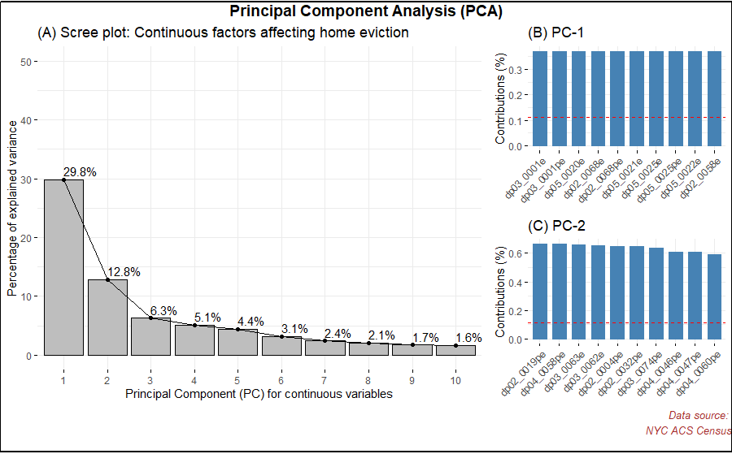

### Exploratory Data Analysis (EDA) & Dimensionality Reduction (DR)

A comprehensive EDA & DR was conducted. The results are presented as follows;

|Data File|Total observations (rows)|Total variables (columns)|Missing values count|Count of Zero Variance variables|Count of Near Zero Variance variables|
|----|----|-----|----|-----|
|nyc_acs5-2018_census.csv|2167|1034|0|50|108|
|nyc_evictions_geocoded.csv|60788|23|26645|50|3|

- After accounting for the above anomalies, I joined the above two data files on a common variable, `tract code`.
- Data dimension of the joined data file was `3730` rows, `898` variables.
- Off the 898 variables, `895` were numeric in nature.

### Dimensionality Reduction using Unsupervised Feature Extraction (UFE) Method: Principal Component Analysis (PCA)

PCA is a UFE method applicable only for continuous variables. Its often confused to be a feature selection method. However, it works by creating Principal Components (PCs), that are eigen vectors of the original feature set and such eigen vectors are actually transformations of the original feature set. Hence, its a feature extraction technique. 
The PCs are visualized using a screeplot, which shows the eigenvalues in decreasing order. 

I applied the PCA method to the `895` continuous variables and in Fig 1, I show the PCs via a scree plot.

- From the scree plot above, see (A) the first two PCs account for the maximum variance in the dataset. I extracted the PC1 & PC2 variables as shown in (B) & (C). It resulted in `158` continuous variables in `3730` rows.
- Therafter, I added a few categorical variables like, `tract_code`, `geoid`, `executed_day`,`executed_month`,`executed_year` and `borough`. The final count of variables is `164` variables in `3730` rows. I've uploaded this cleaned data file at location, `data/_volunteer_created_datasets/_duttashi/df_raw_nycacs_evict_impvars.csv`. 

The R code for the above work can be seen [here](https://github.com/datakind/Mar21-housing-insecurity/blob/main/scripts/_duttashi/nyc_acs_census_and_evictions_feature_extraction.R).

### Further Work

- The cleaned data file, `df_raw_nycacs_evict_impvars.csv` was then filtered on categorical variable `borough`. It has two levels namely, `brooklyn` and `queens`. 
- For `brooklyn` borough, there are 2777 rows in 164 variables.
- For `queens` borough, there are 953 rows in 164 variables.  

- The filtered data files are also uploaded at location, `data/_volunteer_created_datasets/_duttashi/df_raw_nycacs_evict_impvars_brooklyn.csv` and `data/_volunteer_created_datasets/_duttashi/df_raw_nycacs_evict_impvars_queens.csv` 

These two borough level data files will be explored for further analysis.

 

 

